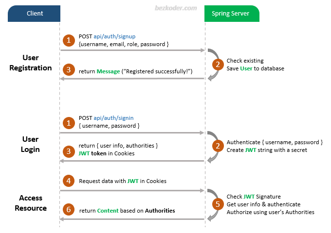
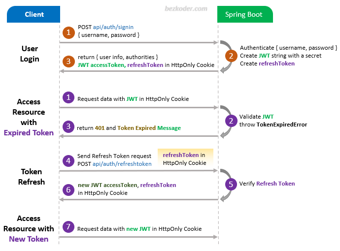
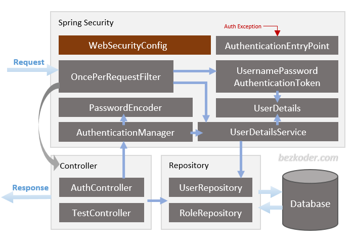
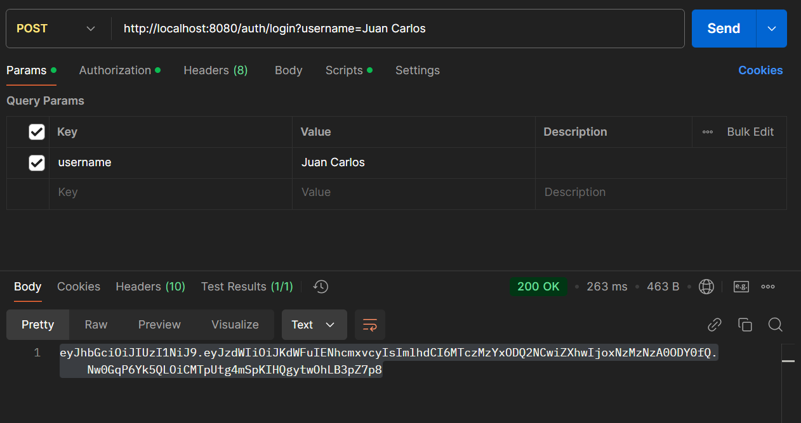
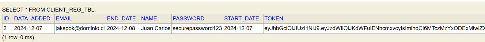
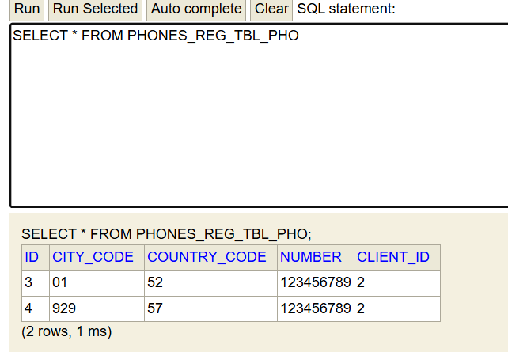
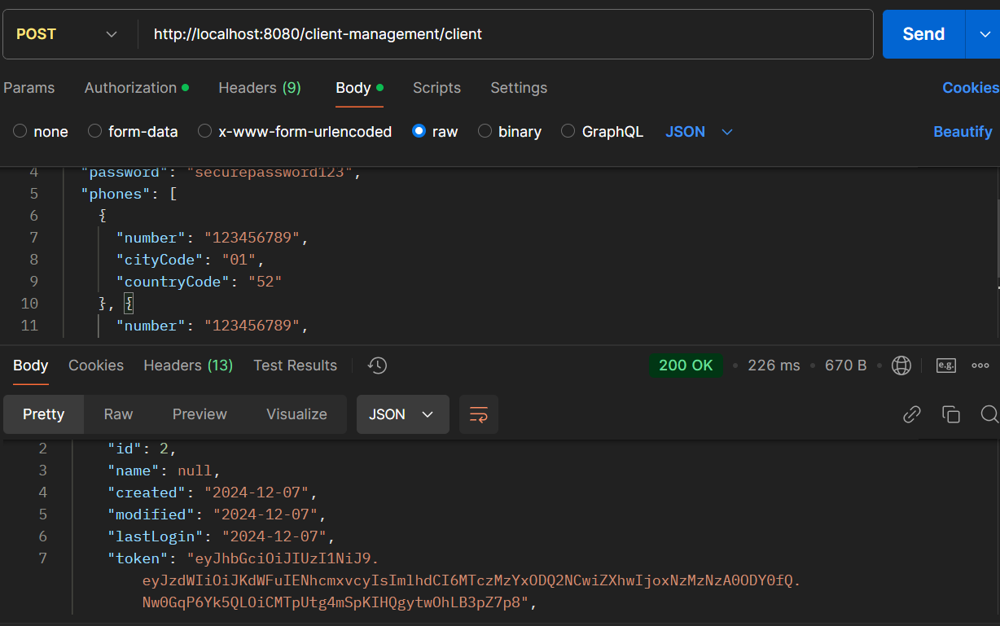
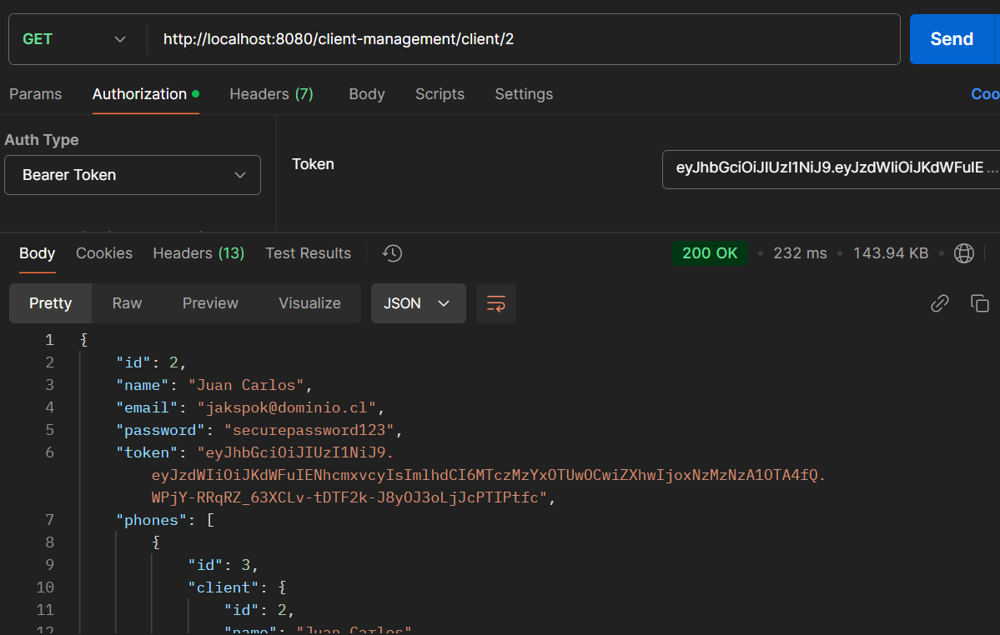
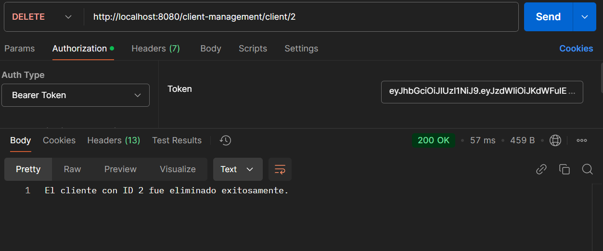
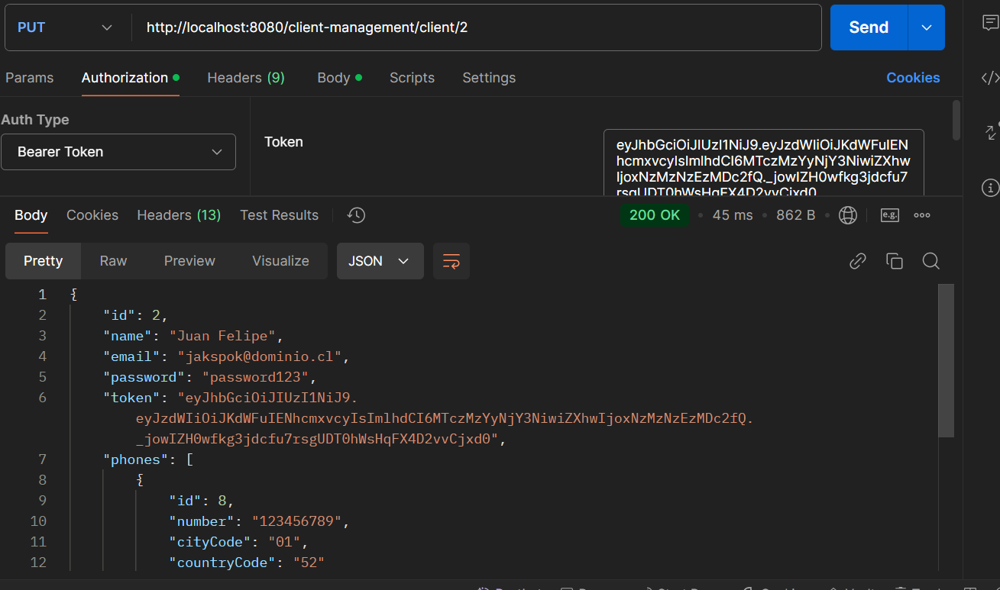

# Spring Boot Clients Management System

## Ejecucion de la solucion

Primero ejecutamos el comando desde la consola `maven clean compile install` para realizar la limpieza compilacion e
instalacion del proyecto

#

Luego ejecutamos el comando desde la consola `mvn springboot:run` para iniciar el backend de la solucion

## Swagger Documentation

La documentacion swagger se encuentra disponible en la url `http://localhost:8080/swagger-ui/`

## H2 Console

La consola de administracion para la DB "H2" disponible en la url `http://localhost:8080/h2-ui`

## Implementacion Solucion

## Autenticacion JWT

Se realiza la implementacion de autentuicacion por medio de token
mediante el cual en base a un endpoint expuesto usando POST "http://localhost:8080/auth/login?username="Juan Carlos" "
se realiza el consumo de este mismo haciendo uso de un parametro "username" : "nombre de usuario"

Mediante el cual nos permite el acceso a los demas recursos , con una configuracion
de 24H

## Diseño Arquitectura Solucion

## Diagrama BD

## Test Aplicacion

## Consumo Token JWT

## Persistencia Cliente

## Persistencia Telefonos

## Creacion De Cliente

## Consulta Cliente Por ID

## Eliminacion De Cliente Por ID

## Actualizacion De Cliente

##Test Unitario Con Coverage

